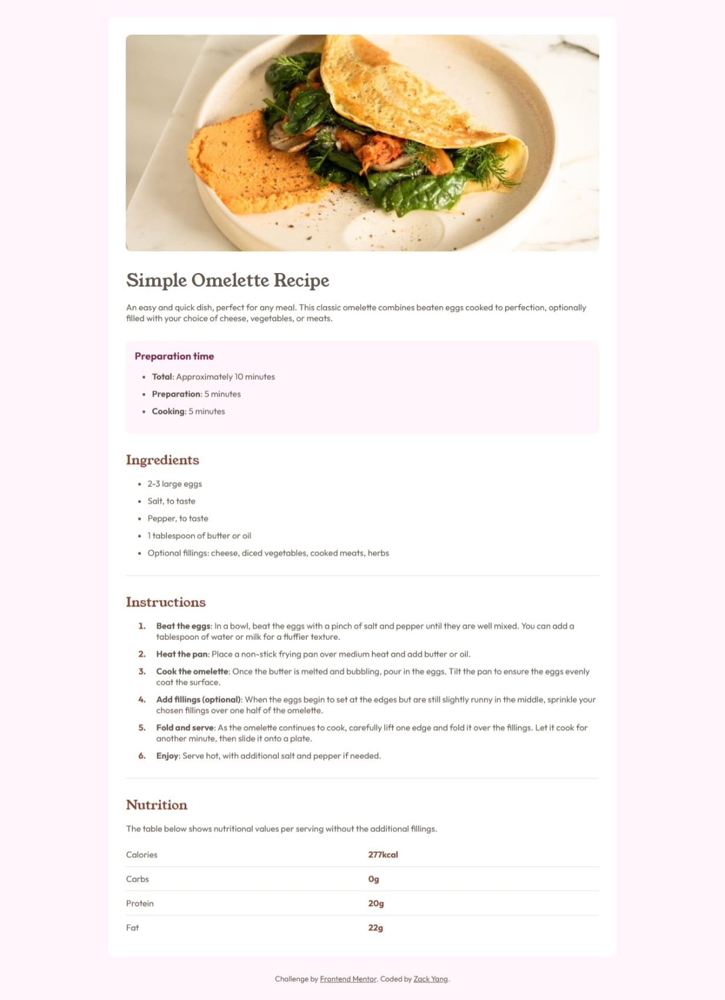
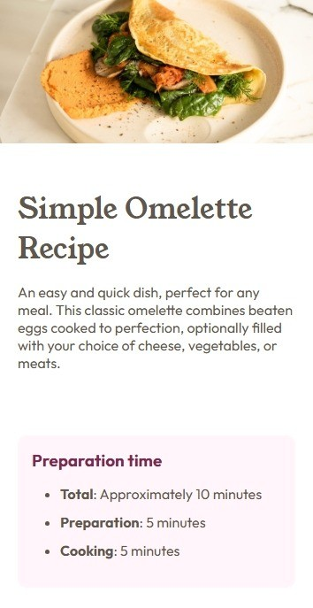
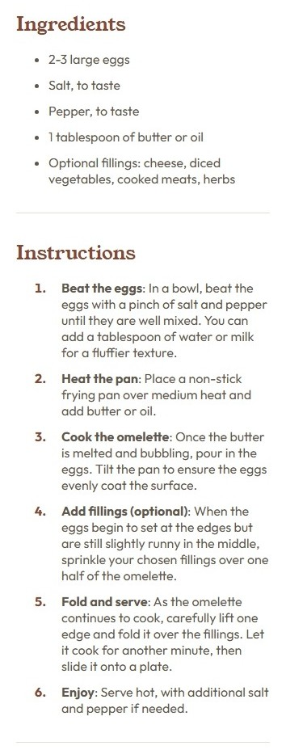
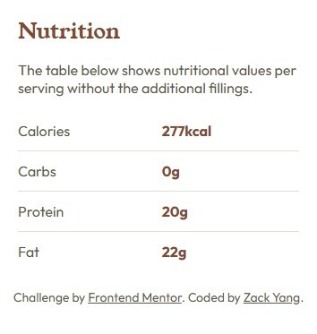

# Frontend Mentor - Recipe page solution

This is a solution to the [Recipe page challenge on Frontend Mentor](https://www.frontendmentor.io/challenges/recipe-page-KiTsR8QQKm). Frontend Mentor challenges help you improve your coding skills by building realistic projects. 

## Table of contents

- [Overview](#overview)
  - [The challenge](#the-challenge)
  - [Screenshot](#screenshot)
  - [Links](#links)
- [My process](#my-process)
  - [Built with](#built-with)
  - [What I learned](#what-i-learned)
- [Author](#author)

## Overview

### Screenshot

### Links

- Solution URL: [https://github.com/ZackDora/recipe-page](https://github.com/ZackDora/recipe-page)
- Live Site URL: [https://zackdora.github.io/recipe-page/](https://zackdora.github.io/recipe-page/)

## My process

### Built with

- HMTL
- CSS

### What I learned

Practicing styling lists and tables

### Continued development

Use this section to outline areas that you want to continue focusing on in future projects. These could be concepts you're still not completely comfortable with or techniques you found useful that you want to refine and perfect.

## Author

- Zack Yang
- Frontend Mentor - [@ZackDora](https://www.frontendmentor.io/profile/ZackDora)
